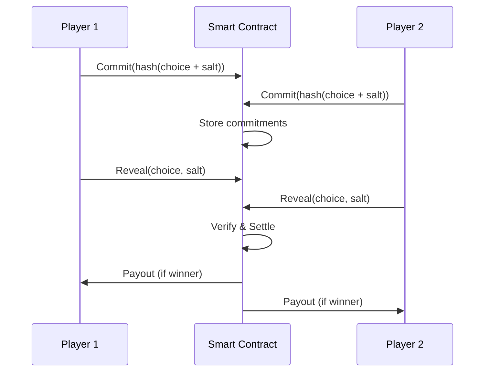

# 🏗️ Architecture Technique - SolDuel Platform

## 🎯 Vue d'Ensemble

SolDuel est une plateforme de jeu PvP décentralisée construite sur Solana, utilisant une architecture modulaire permettant l'ajout facile de nouveaux jeux.

## 🔄 Architecture Système

```
┌─────────────────────────────────────────────────────────┐
│                    🌐 Frontend Layer                      │
│                 React + TypeScript + Vite                 │
├─────────────────────────────────────────────────────────┤
│                   🔗 Integration Layer                    │
│              Anchor Client + Wallet Adapter               │
├─────────────────────────────────────────────────────────┤
│                   ⛓️ Blockchain Layer                     │
│            Solana Smart Contract (Rust/Anchor)            │
├─────────────────────────────────────────────────────────┤
│                    💾 Storage Layer                       │
│                  On-chain PDAs + Accounts                 │
└─────────────────────────────────────────────────────────┘
```

## 🧩 Composants Principaux

### 1. Frontend (React Application)

#### Structure Modulaire
```
src/
├── features/          # Modules de fonctionnalités isolés
│   ├── game-rps/     # Jeu RPS complet
│   ├── auth/         # Authentification wallet
│   ├── leaderboard/  # Système de classement
│   └── profile/      # Gestion des profils
├── components/        # Composants réutilisables
├── services/         # Services et intégrations
└── hooks/            # Hooks React personnalisés
```

#### Technologies Frontend
- **React 18**: Framework UI avec hooks et Suspense
- **TypeScript**: Type safety et IntelliSense
- **Vite**: Build tool rapide avec HMR
- **Tailwind CSS**: Styling utility-first
- **Framer Motion**: Animations performantes
- **Zustand**: State management léger

### 2. Smart Contract (Programme Solana)

#### Architecture du Programme
```rust
programs/rps/
├── src/
│   ├── lib.rs              // Point d'entrée principal
│   ├── instructions/       // Instructions du programme
│   │   ├── create_match.rs
│   │   ├── join_match.rs
│   │   ├── reveal.rs
│   │   └── settle.rs
│   ├── state/             // Structures de données
│   │   ├── match.rs
│   │   └── player.rs
│   └── errors/            // Gestion des erreurs
```

#### Mécanismes Clés
- **Commit-Reveal Scheme**: Prévention de la triche
- **PDA-based Escrow**: Gestion sécurisée des fonds
- **Timeout Protection**: Protection contre l'abandon
- **Fee System**: Commission de plateforme configurable

### 3. Integration Layer

#### Anchor Client Architecture
```typescript
services/anchor/
├── anchor-client.ts    // Client principal
├── types.ts           // Types TypeScript
├── utils.ts           // Fonctions utilitaires
└── index.ts           // Exports
```

#### Flux de Communication
```
User Action → React Hook → Anchor Client → Smart Contract
     ↑                                            ↓
     └──────── État UI Update ← Transaction Result
```

## 🔐 Sécurité & Fairness

### Mécanisme Commit-Reveal



### Sécurité des Comptes

#### Program Derived Addresses (PDAs)
```rust
// Match PDA
seeds = [b"match", creator.key().as_ref(), match_id.as_ref()]

// Vault PDA (Escrow)
seeds = [b"vault", match_pda.key().as_ref()]
```

#### Validation & Vérifications
- Validation des montants de mise
- Vérification des deadlines
- Contrôle des autorisations
- Protection contre les double-spend

## 📊 Flux de Données

### Cycle de Vie d'un Match

```
1. CREATE_MATCH
   ├── Initialiser le match
   ├── Créer l'escrow
   └── Transférer la mise

2. JOIN_MATCH
   ├── Vérifier les conditions
   ├── Stocker le commitment
   └── Transférer la mise

3. REVEAL
   ├── Vérifier le délai
   ├── Valider le commitment
   └── Stocker le choix

4. SETTLE
   ├── Déterminer le gagnant
   ├── Calculer les gains
   └── Distribuer les fonds
```

### État du Match
```typescript
enum MatchStatus {
  WaitingForOpponent,  // En attente d'adversaire
  WaitingForReveal,    // Prêt pour révélation
  ReadyToSettle,       // Prêt pour règlement
  Settled,             // Terminé
  Cancelled,           // Annulé
  TimedOut            // Timeout
}
```

## 🚀 Performance & Optimisation

### Optimisations Frontend

#### Code Splitting
```typescript
// Lazy loading des routes
const GameRPS = lazy(() => import('./features/game-rps'));
const Profile = lazy(() => import('./features/profile'));
```

#### Mémorisation
```typescript
// Mémorisation des composants coûteux
const MatchList = memo(({ matches }) => {
  // Rendu optimisé
});
```

#### Bundle Optimization
- Tree shaking automatique
- Minification du code
- Compression Gzip/Brotli
- Assets optimization

### Optimisations Blockchain

#### Batch Transactions
```typescript
// Grouper les transactions
const tx = new Transaction()
  .add(instruction1)
  .add(instruction2);
```

#### Cache RPC
```typescript
// Cache des requêtes fréquentes
const cache = new Map();
const cachedGetMatch = memoize(getMatch);
```

## 🔄 Patterns d'Architecture

### 1. Feature-Based Structure
```
features/
└── game-rps/
    ├── components/    # UI spécifique
    ├── hooks/        # Logique métier
    ├── utils/        # Helpers
    ├── types.ts      # Types
    └── index.tsx     # Export
```

### 2. Service Layer Pattern
```typescript
// Séparation des concerns
class RPSService {
  private client: AnchorClient;
  
  async createMatch(params) {
    // Logique métier
    return this.client.createMatch(params);
  }
}
```

### 3. Hook Composition
```typescript
// Composition de hooks
const useRPSGame = () => {
  const wallet = useWallet();
  const connection = useConnection();
  const toast = useToast();
  
  // Logique combinée
};
```

## 🌐 Scalabilité

### Architecture Modulaire

#### Ajout de Nouveaux Jeux
```
1. Créer feature/new-game/
2. Implémenter le smart contract
3. Créer les composants UI
4. Intégrer au router
```

#### Extension du Système
- Support multi-tokens (SPL)
- Tournois et ligues
- Système de récompenses
- Chat en temps réel

### Considérations de Scale

#### Performance Targets
- **TPS**: 65,000 (Solana max)
- **Latency**: < 400ms
- **Bundle Size**: < 500KB
- **Load Time**: < 3s (3G)

#### Horizontal Scaling
```
├── Multiple RPC endpoints
├── CDN pour les assets
├── Load balancing
└── Cache distribué
```

## 🔧 Technologies Stack

### Frontend Stack
| Technologie | Version | Usage |
|-------------|---------|-------|
| React | 18.3.1 | UI Framework |
| TypeScript | 5.x | Type Safety |
| Vite | 4.2.1 | Build Tool |
| Tailwind | 3.x | Styling |
| Framer Motion | 12.x | Animations |

### Blockchain Stack
| Technologie | Version | Usage |
|-------------|---------|-------|
| Solana | 1.18+ | Blockchain |
| Anchor | 0.31+ | Framework |
| Web3.js | 1.98+ | SDK |
| Wallet Adapter | 0.15+ | Wallets |

### DevOps Stack
| Technologie | Usage |
|-------------|-------|
| Docker | Containerisation |
| GitHub Actions | CI/CD |
| Vercel | Hosting |
| Prometheus | Monitoring |

## 📈 Monitoring & Observability

### Métriques Clés
```typescript
// Performance metrics
- Transaction Success Rate
- Average Confirmation Time
- Bundle Size
- Time to Interactive
- Error Rate
```

### Logging Strategy
```typescript
// Structured logging
logger.info('Match created', {
  matchId,
  creator,
  betAmount,
  timestamp
});
```

## 🎯 Roadmap Technique

### Phase 1: Core Platform ✅
- [x] Smart contract RPS
- [x] Interface utilisateur
- [x] Wallet integration
- [x] Système d'escrow

### Phase 2: Enhancements 🚧
- [ ] Support multi-tokens
- [ ] Système de tournois
- [ ] Leaderboard global
- [ ] Mobile app

### Phase 3: Expansion 📋
- [ ] Nouveaux jeux
- [ ] NFT rewards
- [ ] DAO governance
- [ ] Cross-chain bridge

## 🔍 Points Clés à Retenir

1. **Modularité**: Architecture feature-based pour faciliter l'extension
2. **Sécurité**: Commit-reveal et PDA pour une sécurité maximale
3. **Performance**: Optimisations à tous les niveaux
4. **Scalabilité**: Prêt pour la croissance
5. **Maintenabilité**: Code propre et bien organisé

---

*📚 Pour plus de détails techniques, consultez [API_DOCUMENTATION.md](./API_DOCUMENTATION.md)*

*🛠️ Pour commencer à développer, voir [DEVELOPER_GUIDE.md](./DEVELOPER_GUIDE.md)*