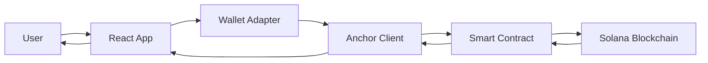

# 👨‍💻 Guide du Développeur - SolDuel Platform

## 🚀 Démarrage Rapide

### Prérequis
```bash
# Outils requis
- Node.js v18+ 
- Rust & Cargo
- Solana CLI v1.18+
- Anchor Framework v0.31+
- Git
```

### Installation en 3 étapes
```bash
# 1. Cloner le projet
git clone <repository>
cd platform

# 2. Installer les dépendances
npm install

# 3. Lancer en développement
npm run dev
```

## 📁 Navigation dans le Projet

### Structure Simplifiée
```
platform/
├── 📦 src/         # ← Votre code frontend ici
├── 🧪 tests/       # ← Tests automatisés
├── 📚 docs/        # ← Documentation (vous êtes ici!)
├── 🚀 programs/    # ← Smart contracts Rust
├── 🌐 public/      # ← Assets statiques
├── 📜 scripts/     # ← Scripts utilitaires
└── 🏗️ dist/       # ← Build de production
```

### Où trouver quoi ?

| Besoin | Emplacement | Fichier clé |
|--------|-------------|-------------|
| 🎮 Logique du jeu RPS | `src/features/game-rps/` | `index.tsx` |
| 🔗 Client Solana | `src/services/anchor/` | `anchor-client.ts` |
| 📱 Composants UI | `src/components/` | `ui/`, `layout/` |
| ⚙️ Configuration | `src/config/` | `constants.ts` |
| 🧪 Tests | `tests/` | `unit/`, `e2e/` |
| 📄 Smart Contract | `programs/rps/src/` | `lib.rs` |

## 🛠️ Workflows de Développement

### 1️⃣ Développement Frontend

#### Structure des Features
```
src/features/game-rps/
├── components/       # Composants React
├── hooks/           # Hooks personnalisés
├── utils/           # Fonctions utilitaires
├── types.ts         # Types TypeScript
└── index.tsx        # Point d'entrée
```

#### Commandes Utiles
```bash
# Développement
npm run dev          # Serveur de dev (port 5173)

# Build & Test
npm run build        # Build production
npm run test         # Tests unitaires
npm run test:e2e     # Tests end-to-end

# Qualité du code
npm run lint         # Linting
npm run type-check   # Vérification TypeScript
```

### 2️⃣ Développement Smart Contract

#### Structure Rust
```
programs/rps/src/
├── lib.rs           # Programme principal
├── games/           # Modules de jeu
│   ├── mod.rs
│   └── rock_paper_scissors.rs
└── universal_engine.rs  # Moteur universel
```

#### Commandes Anchor
```bash
# Build & Deploy
anchor build         # Compiler le programme
anchor test          # Lancer les tests
anchor deploy        # Déployer sur devnet

# Devnet
solana config set --url devnet
solana airdrop 2    # Obtenir des SOL de test
```

### 3️⃣ Architecture des Composants

#### Hiérarchie des Composants
```
App.tsx
├── Layout
│   ├── Header
│   └── UserButton
├── Features
│   ├── GameRPS
│   │   ├── MatchLobby
│   │   ├── GameInterface
│   │   └── CreateMatchModal
│   ├── Leaderboard
│   └── Profile
└── Services
    └── AnchorClient
```

#### Flux de Données
```
Wallet → AnchorClient → Smart Contract
   ↑          ↓              ↓
   └── React Hook ← État Local
```

## 🔧 Patterns et Best Practices

### React & TypeScript

#### Composant Feature
```typescript
// src/features/game-rps/components/MatchCard.tsx
import { FC } from 'react';
import { MatchAccount } from '../types';

interface MatchCardProps {
  match: MatchAccount;
  onJoin: (match: MatchAccount) => void;
}

export const MatchCard: FC<MatchCardProps> = ({ match, onJoin }) => {
  // Logique du composant
  return (
    <div className="match-card">
      {/* UI */}
    </div>
  );
};
```

#### Hook Personnalisé
```typescript
// src/features/game-rps/hooks/useRPSGame.ts
export const useRPSGame = () => {
  const [matches, setMatches] = useState<MatchAccount[]>([]);
  
  const createMatch = async (params: CreateMatchParams) => {
    // Logique de création
  };
  
  return {
    matches,
    createMatch,
  };
};
```

### Solana & Anchor

#### Interaction avec le Programme
```typescript
// src/services/anchor/anchor-client.ts
export class RPSClient {
  constructor(
    private connection: Connection,
    private wallet: WalletContextState,
    private programId: PublicKey
  ) {}
  
  async createMatch(params: CreateMatchParams) {
    const tx = await this.program.methods
      .createMatch(params.betAmount, commitment)
      .accounts({
        creator: this.wallet.publicKey,
        matchPda,
        systemProgram: SystemProgram.programId,
      })
      .rpc();
    
    return tx;
  }
}
```

## 📊 Architecture Technique

### Stack Technologique

#### Frontend
- **React 18** + **TypeScript** - Framework UI
- **Vite** - Build tool ultra-rapide
- **Tailwind CSS** - Styling utility-first
- **Framer Motion** - Animations fluides
- **Zustand** - State management léger

#### Blockchain
- **Solana Web3.js** - Interaction blockchain
- **Anchor Framework** - Framework smart contract
- **Wallet Adapter** - Intégration wallets

#### Outils
- **Claude Flow** - Orchestration IA
- **SPARC** - Méthodologie TDD
- **Vitest** - Tests unitaires

### Flux d'Exécution



## 🧪 Tests

### Structure des Tests
```
tests/
├── unit/           # Tests unitaires
├── integration/    # Tests d'intégration
├── e2e/           # Tests end-to-end
└── performance/   # Tests de performance
```

### Lancer les Tests
```bash
# Tous les tests
npm run test:all

# Par type
npm run test:unit
npm run test:integration
npm run test:e2e

# Avec coverage
npm run test:coverage
```

### Exemple de Test
```typescript
// tests/unit/rps-game-logic.test.ts
describe('RPS Game Logic', () => {
  it('should determine winner correctly', () => {
    expect(determineWinner('rock', 'scissors')).toBe('player1');
    expect(determineWinner('paper', 'rock')).toBe('player1');
    expect(determineWinner('scissors', 'paper')).toBe('player1');
  });
});
```

## 🚀 Déploiement

### Environnements

| Environnement | URL | Réseau | Usage |
|---------------|-----|--------|-------|
| Development | localhost:5173 | Devnet | Développement local |
| Staging | staging.solduel.app | Devnet | Tests pré-prod |
| Production | solduel.app | Mainnet | Production |

### Process de Déploiement

#### 1. Build Frontend
```bash
npm run build
# → Génère dist/
```

#### 2. Deploy Smart Contract
```bash
# Mainnet
anchor build --verifiable
anchor deploy --provider.cluster mainnet
```

#### 3. Variables d'Environnement
```env
# .env.production
VITE_RPC_ENDPOINT=https://api.mainnet-beta.solana.com
VITE_PROGRAM_ID=32tQhc2c4LurhdBwDzzV8f3PtdhKm1iVaPSumDTZWAvb
VITE_NETWORK=mainnet-beta
```

## 🔐 Sécurité

### Checklist de Sécurité
- [ ] Validation des entrées côté client ET smart contract
- [ ] Gestion des erreurs appropriée
- [ ] Pas de clés privées dans le code
- [ ] Utilisation de PDAs pour les comptes
- [ ] Tests de sécurité passés
- [ ] Audit du smart contract effectué

### Bonnes Pratiques
```typescript
// ✅ BON - Utiliser des constantes
const PROGRAM_ID = new PublicKey(process.env.VITE_PROGRAM_ID);

// ❌ MAUVAIS - Hardcoder les clés
const PROGRAM_ID = new PublicKey("32tQhc2c4LurhdBwDzzV8f3PtdhKm1iVaPSumDTZWAvb");
```

## 📈 Performance

### Optimisations Appliquées
- Code splitting automatique
- Lazy loading des routes
- Compression des assets
- Cache des requêtes RPC
- Bundle < 500KB

### Monitoring
```typescript
// Performance tracking
const measurePerformance = () => {
  const perfData = performance.getEntriesByType('navigation')[0];
  console.log('Load time:', perfData.loadEventEnd - perfData.fetchStart);
};
```

## 🤝 Contribution

### Workflow Git
```bash
# 1. Créer une branche
git checkout -b feature/ma-feature

# 2. Développer et commiter
git add .
git commit -m "feat: description de la feature"

# 3. Push et PR
git push origin feature/ma-feature
# → Créer Pull Request sur GitHub
```

### Convention de Commit
- `feat:` Nouvelle fonctionnalité
- `fix:` Correction de bug
- `docs:` Documentation
- `style:` Formatage
- `refactor:` Refactoring
- `test:` Tests
- `chore:` Maintenance

## 📞 Support & Ressources

### Documentation
- [PROJECT_INDEX.md](./PROJECT_INDEX.md) - Vue d'ensemble
- [API_DOCUMENTATION.md](./API_DOCUMENTATION.md) - Référence API
- [ARCHITECTURE_OVERVIEW.md](./ARCHITECTURE_OVERVIEW.md) - Architecture

### Liens Utiles
- [Solana Docs](https://docs.solana.com)
- [Anchor Book](https://www.anchor-lang.com)
- [React Docs](https://react.dev)

### Aide Rapide
```bash
# Problème de build?
npm run clean && npm install

# Erreur Solana?
solana config get  # Vérifier la config

# Tests qui échouent?
npm run test -- --watch
```

---

*💡 Astuce: Utilisez `npm run dev` et gardez la console ouverte pour voir les erreurs en temps réel!*

*🎯 Objectif: Code propre, tests passants, utilisateurs heureux!*