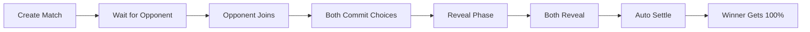

# 🎮 Rock Paper Scissors Client Testing Guide

## ✅ Implementation Complete!

The full Rock Paper Scissors client for Solana Devnet has been successfully implemented with complete on-chain interactions.

## 🚀 Quick Start

### 1. Configure Implementation Mode

Edit `/src/config/rps-config.ts`:

```typescript
export const RPS_CONFIG = {
  // Set to true for real on-chain transactions
  USE_REAL_IMPLEMENTATION: true,
  // ...
};
```

### 2. Start the Development Server

```bash
npm run dev
```

The app will open at http://localhost:3000

### 3. Connect Phantom Wallet

1. Install Phantom wallet extension
2. Switch to **Devnet** network in Phantom settings
3. Get free Devnet SOL from: https://faucet.solana.com/

### 4. Look for the Status Indicator

Bottom-right corner shows:
- 🔗 **ON-CHAIN** = Real blockchain transactions
- 🧪 **MOCK MODE** = UI testing only

## 📋 Testing Checklist

### Phase 1: Connection & Setup
- [ ] Phantom wallet connects successfully
- [ ] Devnet network is selected
- [ ] Status indicator shows "ON-CHAIN"
- [ ] Balance shows in SOL

### Phase 2: Create Match Flow
1. [ ] Click "Create Match" button
2. [ ] Enter bet amount (minimum 0.001 SOL)
3. [ ] Select Rock, Paper, or Scissors
4. [ ] Confirm transaction in Phantom
5. [ ] Transaction signature appears in toast
6. [ ] Match appears in "Your Matches" list
7. [ ] Status shows "Waiting for Opponent"

### Phase 3: Join Match Flow
1. [ ] See available matches in lobby
2. [ ] Click "Join" on an open match
3. [ ] Select your choice (Rock/Paper/Scissors)
4. [ ] Confirm bet amount transaction
5. [ ] Transaction confirmation appears
6. [ ] Match moves to "Playing" phase

### Phase 4: Reveal Phase
1. [ ] Both players have joined
2. [ ] "Reveal Choice" button appears
3. [ ] Click to reveal your committed choice
4. [ ] Transaction confirms
5. [ ] Wait for opponent to reveal
6. [ ] Both reveals complete

### Phase 5: Settlement
1. [ ] Match auto-settles after both reveals
2. [ ] Winner is determined
3. [ ] Funds transferred to winner (0% fees!)
4. [ ] Result displayed with animation
5. [ ] Winner receives full pot

### Phase 6: Edge Cases
- [ ] Timeout claim (opponent doesn't reveal)
- [ ] Cancel match (no opponent joins)
- [ ] Multiple matches simultaneously
- [ ] Refresh page maintains state
- [ ] Commitment data persists locally

## 🔍 Key Features Implemented

### 1. **Anchor Client (`rps-anchor-client.ts`)**
- ✅ Full IDL integration
- ✅ Transaction building with priority fees
- ✅ PDA calculations (match, vault)
- ✅ Event subscriptions
- ✅ Error handling

### 2. **Commitment-Reveal System**
- ✅ SHA-256 commitment generation
- ✅ Salt generation and storage
- ✅ Local storage for secrets
- ✅ Reveal verification on-chain

### 3. **Real-time Updates**
- ✅ 2-second polling interval
- ✅ WebSocket subscriptions
- ✅ Automatic phase transitions
- ✅ Live match status updates

### 4. **Transaction Management**
- ✅ Compute budget optimization
- ✅ Priority fees included
- ✅ Transaction confirmation tracking
- ✅ Error recovery

### 5. **UI Feedback**
- ✅ Loading states for all actions
- ✅ Toast notifications
- ✅ Transaction signatures displayed
- ✅ Implementation status indicator

## 🛠️ Debugging

### Check Console Logs
```javascript
// The wrapper logs which implementation is active
"Using REAL RPS implementation - On-chain transactions enabled"
// or
"Using MOCK RPS implementation - For UI testing only"
```

### Verify Program Deployment
- Program ID: `4bdQ9U3yXD9EY2SxxMVasPmp5gw7RLtnc8yTkFZovmRR`
- Explorer: https://explorer.solana.com/address/4bdQ9U3yXD9EY2SxxMVasPmp5gw7RLtnc8yTkFZovmRR?cluster=devnet

### Common Issues & Solutions

1. **"Wallet not connected"**
   - Ensure Phantom is installed
   - Check Devnet is selected
   - Refresh and reconnect

2. **"Insufficient funds"**
   - Get free SOL from faucet
   - Check minimum bet (0.001 SOL)
   - Account for transaction fees

3. **"Transaction failed"**
   - Check network (must be Devnet)
   - Verify program is deployed
   - Check console for errors

4. **"Commitment not found"**
   - Check localStorage
   - Don't clear browser data during game
   - Commitment stored with prefix: `rps_commitment_`

## 📊 Architecture Overview

```
Frontend (React)
    ↓
useRPSGameWrapper (Switch)
    ↓
useRPSGameReal (Hook)
    ↓
RPSAnchorClient (Anchor)
    ↓
Universal PvP Program (Solana)
```

## 🎯 Game Flow



## 🚦 Status Codes

- `WaitingForOpponent` - Match created, needs player 2
- `WaitingForCommit` - Both players committing choices
- `WaitingForReveal` - Time to reveal choices
- `ReadyToSettle` - Both revealed, settling
- `Settled` - Complete, funds distributed
- `Cancelled` - Match cancelled
- `TimedOut` - Timeout occurred

## 💡 Tips for Testing

1. **Use small amounts** (0.001 SOL) for testing
2. **Open two browsers** to test as both players
3. **Check localStorage** for commitment data
4. **Monitor console** for detailed logs
5. **Use Explorer** to verify transactions

## 🔗 Resources

- **Solana Faucet**: https://faucet.solana.com/
- **Phantom Wallet**: https://phantom.app/
- **Solana Explorer**: https://explorer.solana.com/?cluster=devnet
- **Program Source**: `/programs/universal_pvp/`

## ✨ Features Highlights

- **0% Platform Fees** - Winner takes entire pot!
- **Commit-Reveal** - Secure, cheat-proof gameplay
- **Real-time Updates** - Live match status
- **Multi-Round Support** - Best of 3/5/7 (configurable)
- **Timeout Protection** - Auto-claim if opponent disappears
- **Local Secret Storage** - Commitments saved securely

## 🎮 Ready to Play!

The implementation is complete and ready for testing on Solana Devnet. Connect your wallet, get some test SOL, and start playing Rock Paper Scissors with real blockchain transactions!

**Remember**: This is DEVNET - use test SOL only!