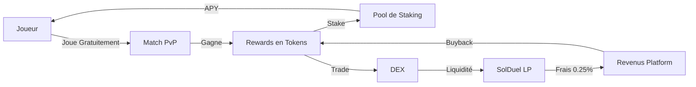

# 💎 Modèle Économique 0% Frais - Révolution PvP

## 🎯 Le Concept Révolutionnaire

**"Les casinos prennent 2-5% sur chaque pari. Nous prenons 0%."**

### Pourquoi 0% Frais Change Tout

1. **Vrai PvP** - Les joueurs parient directement l'un contre l'autre
2. **Équité Parfaite** - 50/50 devient vraiment 50/50
3. **Adoption Massive** - Pas de friction économique
4. **Narrative Puissant** - "Le seul casino où la maison ne gagne jamais"

## 💰 Comment la Plateforme Gagne de l'Argent

### 1. Launchpad de Tokens de Jeux

```typescript
// Chaque nouveau jeu lance son token
interface GameTokenLaunch {
  raising: 100_SOL;           // Objectif de levée
  platform_fee: 2_SOL;        // 2% pour la plateforme
  token_allocation: {
    public_sale: 30%;         // Vendu sur launchpad
    platform: 5%;            // Tokens pour SolDuel
    creator: 20%;            // Créateur du jeu
    rewards: 45%;            // Récompenses joueurs
  };
}

// Exemple de revenus
// 20 jeux lancés par an × 100 SOL × 2% = 40 SOL
// + 5% des tokens de chaque jeu
```

### 2. Trading de Tokens & DeFi

```typescript
interface TokenEconomy {
  // Les tokens se tradent sur DEX
  trading_volume_daily: "$1M";
  
  // SolDuel fournit liquidité initiale
  liquidity_provided: {
    initial_pool: "10 SOL + 100K tokens";
    lp_fees_earned: "0.25% par trade";
    impermanent_loss: "Compensé par volume";
  };
  
  // Yield farming
  staking_pools: {
    token_staking: "10% APY";
    lp_staking: "50% APY";
    platform_share: "20% des rewards";
  };
}
```

### 3. Services Premium (Optionnels)

```typescript
interface PremiumServices {
  // Gratuit de jouer, payant pour plus
  pro_subscription: {
    price: "5 USDC/mois";
    features: [
      "Statistiques détaillées",
      "Replay de matchs",
      "Badges exclusifs",
      "Accès API",
      "Tournois privés"
    ];
  };
  
  // NFT Collections
  game_nfts: {
    custom_avatars: "10 SOL",
    victory_animations: "5 SOL",
    rare_skins: "20 SOL",
    platform_royalty: "5%"
  };
  
  // Publicité native
  sponsored_tournaments: {
    sponsor_fee: "500 SOL",
    visibility: "100K+ joueurs",
    brand_integration: true
  };
}
```

## 🎮 Système de Tokens par Jeu

### Architecture Multi-Token

```rust
pub struct GameTokenSystem {
    // Chaque jeu = 1 token unique
    pub game_tokens: HashMap<GameId, TokenInfo>,
    
    // Token master (optionnel)
    pub platform_token: Option<MasterToken>,
    
    // Mécanismes de burn
    pub deflationary_mechanics: DeflationRules,
}

// Exemple: RPS Token
pub struct RPSToken {
    // Tokenomics
    pub total_supply: 1_000_000_000,
    pub initial_price: 0.0001, // SOL
    
    // Utilité
    pub utilities: vec![
        "Parier avec 50% de réduction de frais réseau",
        "Accès aux tournois exclusifs RPS",
        "Boost de rewards x2 en weekend",
        "Gouvernance des règles RPS",
        "Staking pour rewards passifs"
    ],
    
    // Distribution
    pub earning_mechanics: vec![
        "1 RPST par victoire",
        "10 RPST par série de 5 victoires",
        "100 RPST pour top 10 mensuel",
        "0.1 RPST par match joué"
    ]
}
```

### Économie Circulaire


```mermaid
graph LR
    A[Joueur] -->|Joue Gratuitement| B[Match PvP]
    B -->|Gagne| C[Rewards en Tokens]
    C -->|Stake| D[Pool de Staking]
    D -->|APY| A
    C -->|Trade| E[DEX]
    E -->|Liquidité| F[SolDuel LP]
    F -->|Frais 0.25%| G[Revenus Platform]
    G -->|Buyback| C
```

## 🚀 Modèle de Croissance

### Phase 1: Acquisition (Mois 1-3)
```typescript
const userAcquisition = {
  strategy: "0% fees marketing",
  channels: [
    "Twitter: 'Le seul casino qui ne prend rien'",
    "Reddit: Comparaisons avec compétiteurs",
    "Influencers: Défis PvP publics"
  ],
  cost: 0, // Marketing organique
  target: "10,000 joueurs actifs"
};
```

### Phase 2: Monétisation (Mois 4-6)
```typescript
const monetization = {
  token_launches: {
    games_per_month: 3,
    revenue_per_launch: "2 SOL",
    token_appreciation: "10-100x potentiel"
  },
  
  premium_adoption: {
    conversion_rate: "5%",
    revenue_per_user: "5 USDC/mois",
    ltv: "60 USDC"
  },
  
  defi_revenue: {
    tvl_target: "1M USDC",
    yield_share: "20%",
    annual_revenue: "200K USDC"
  }
};
```

### Phase 3: Expansion (Mois 7-12)
```typescript
const expansion = {
  multi_chain: {
    chains: ["Ethereum", "Polygon", "BSC"],
    bridge_fees: "0.1%",
    new_users: "100K+"
  },
  
  b2b_licensing: {
    white_label: "1000 SOL/an",
    api_access: "100 SOL/mois",
    custom_games: "500 SOL"
  },
  
  dao_treasury: {
    accumulated_value: "10M USDC",
    investment_returns: "15% APY",
    grant_program: "100K USDC/quarter"
  }
};
```

## 📊 Projections Financières

### Année 1
| Source | Revenus | Coûts | Profit |
|--------|---------|-------|--------|
| Launchpad | 120 SOL | 20 SOL | 100 SOL |
| Token Holdings | 500 SOL* | 0 | 500 SOL |
| Premium | 100 SOL | 10 SOL | 90 SOL |
| DeFi | 200 SOL | 50 SOL | 150 SOL |
| **Total** | **920 SOL** | **80 SOL** | **840 SOL** |

*Valeur estimée des tokens reçus

### Année 2-3
- TVL: $10M+
- Revenus annuels: $1M+
- Joueurs actifs: 1M+
- Jeux créés: 100+

## 🎯 Avantages Compétitifs

### 1. Narrative Unique
> "Nous sommes le Robin Hood des casinos - 0% pour la maison, 100% pour les joueurs"

### 2. Effets de Réseau
- Plus de joueurs → Plus de liquidité
- Plus de jeux → Plus de créateurs
- Plus de tokens → Plus de trading
- Plus de trading → Plus de revenus

### 3. Alignement d'Intérêts
```typescript
const alignment = {
  players: "Jouent gratuitement, gagnent des tokens",
  creators: "Créent des jeux, gagnent des royalties",
  investors: "Investissent tôt, profitent de la croissance",
  platform: "Facilite tout, prend une part de la valeur créée"
};
```

## 🔮 Vision Long Terme

### The Endgame
1. **Plus grande plateforme PvP blockchain**
2. **Standard de l'industrie** pour jeux équitables
3. **Écosystème auto-suffisant** sans frais
4. **Valorisation $1B+** via tokens et DeFi

### Expansion Possibilities
- **SolDuel Chain**: L3 dédié aux jeux
- **SDK Mobile**: Unity/Unreal plugins
- **eSports League**: Tournois professionnels
- **Metaverse Integration**: Jeux en VR/AR

## 💡 Pourquoi Ça Marche

### Psychologie du Joueur
```typescript
const playerPsychology = {
  traditional_casino: {
    thought: "La maison gagne toujours",
    feeling: "Je vais perdre à long terme",
    action: "Joue peu ou pas"
  },
  
  solduel_platform: {
    thought: "C'est vraiment 50/50",
    feeling: "J'ai une vraie chance",
    action: "Joue plus souvent"
  }
};
```

### Mathématiques
```typescript
// Casino traditionnel
const traditional = {
  player_bet: 100,
  house_edge: 5,
  expected_return: 95,
  long_term: "Perte garantie"
};

// SolDuel
const solduel = {
  player_bet: 100,
  platform_fee: 0,
  expected_return: 100,
  long_term: "Pure compétence/chance"
};
```

## 🚀 Call to Action

**"Rejoignez la révolution du vrai PvP. Zéro frais. Pour toujours."**

---

*Ce n'est pas juste une plateforme de jeux. C'est une déclaration : les joueurs méritent mieux.*